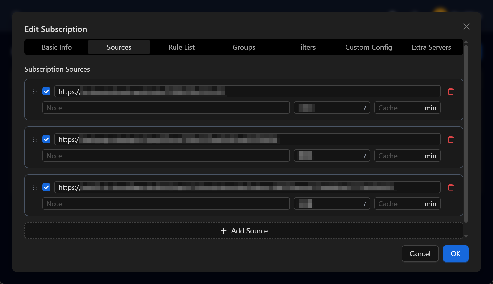
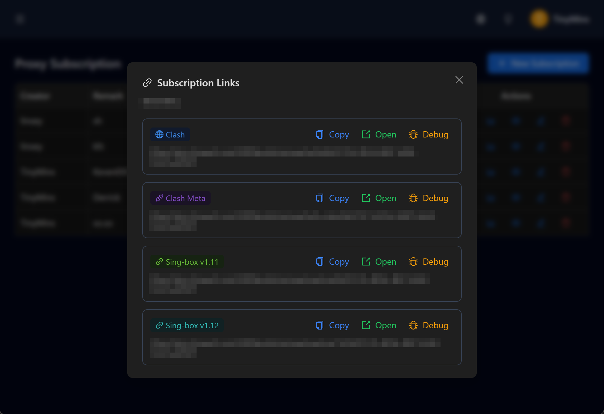
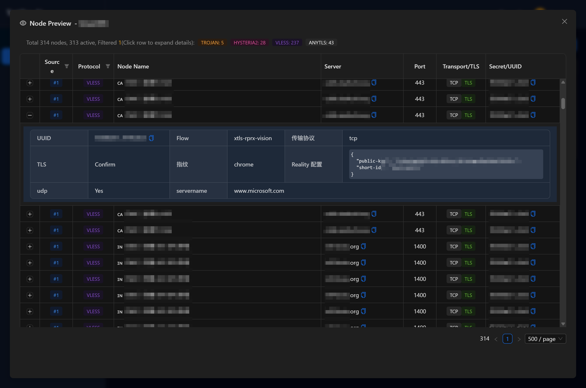
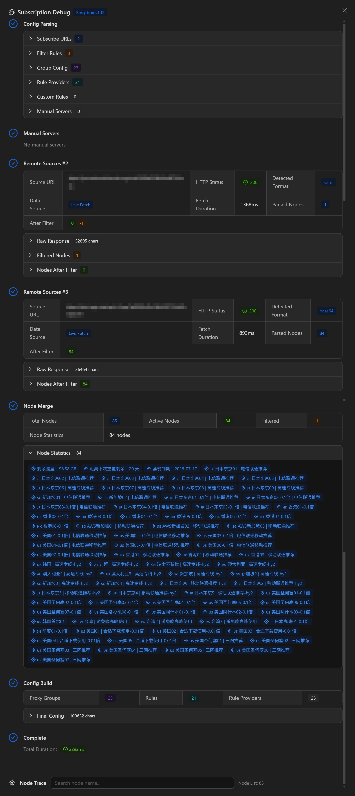
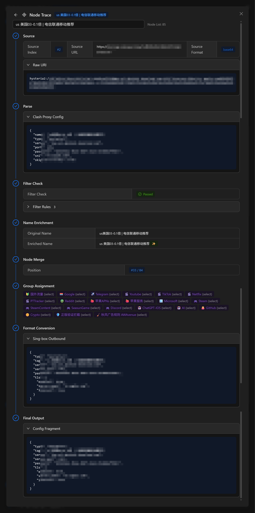
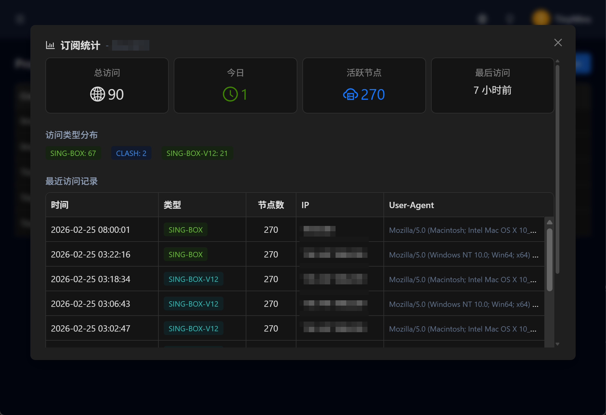

# OhMyWrt Toolbox

[English](README.md)

自托管的代理订阅管理工具 —— 聚合多个上游代理源，按需过滤、分组，一键生成 Clash / Sing-box 订阅链接。

## ✨ 核心功能

### 🔗 代理订阅管理
- **多源聚合**：添加多个上游代理订阅地址，统一管理，每个源可独立配置前缀、缓存 TTL、启用/禁用
- **节点过滤**：基于关键词的节点筛选（内置系统默认规则或自定义 JSONC 配置）
- **分组管理**：灵活配置代理分组（如 `🔰 国外流量`、`🏳️‍🌈 Google`、`✈️ Telegram`、`🎬 Netflix`、`🤖 AI`、`🐙 GitHub` 等）
- **规则路由**：按服务分流的路由规则配置
- **双格式输出**：同时生成 **Clash** (YAML) 和 **Sing-box** (JSON) 配置文件
- **公开订阅链接**：无需认证的订阅 URL，可直接导入代理客户端
- **调试模式**：实时流式查看订阅处理过程（源拉取 → 过滤 → 合并 → 输出），支持逐节点追踪
- **访问统计**：记录订阅下载日志（类型、IP、UA、节点数量）

### 🌐 网络数据服务
- **GeoIP 中国**：聚合 APNIC、Loyalsoldier 等多源中国 IPv4 CIDR 列表
- **GeoSite 中国**：中国域名列表，用于 DNS 分流

### 👥 用户与权限
- **角色体系**：超级管理员 > 管理员 > 普通用户，三级权限控制
- **用户管理**：支持注册（可选邀请码机制）、登录、个人设置
- **会话管理**：基于 Session 的认证机制

### 🏢 工作区
- **多租户支持**：创建多个工作区，独立管理各自的订阅和数据
- **单工作区模式**：适用于个人/小团队部署，简化 URL 结构
- **成员管理**：工作区级别的成员与角色控制

### 🛡️ 系统管理
- **系统设置**：开关注册、单工作区模式等全局配置
- **邀请码**：超级管理员发放、一次性使用、可设置过期时间
- **用户 CRUD**：管理面板中的完整用户管理

### 🌍 国际化
支持 9 种语言，包括：简体中文、繁体中文、英语、日语、德语、粤语、吴语、客家话、文言文。

### 🎨 主题
支持明暗主题切换，可设为跟随系统。

## � 页面截图

**编辑订阅** —— 管理多个上游订阅源，每个源可独立配置前缀、缓存时间与启用/禁用



**订阅链接** —— 一键复制 Clash / Clash Meta / Sing-box 订阅地址



**节点预览** —— 浏览全部代理节点，查看协议、服务器、端口、传输方式等详情



**订阅调试** —— 实时流式查看处理管线（配置解析 → 源拉取 → 过滤 → 合并 → 输出）



**节点追踪** —— 单节点全生命周期追踪（来源 → 解析 → 过滤 → 名称增强 → 分组分配 → 格式转换 → 最终输出）



**访问统计** —— 订阅下载日志，包含类型分布、IP、UA、节点数量



## �📚 技术栈

| 层级 | 技术 |
|------|------|
| **前端** | React 19, Vite 7, TailwindCSS 4, Ant Design 6, TanStack Query, React Router v7, Framer Motion |
| **后端** | NestJS 11, tRPC v11 (端到端类型安全), Drizzle ORM, Zod v4 |
| **数据库** | PostgreSQL 16 |
| **基础设施** | Docker Compose, pnpm Monorepo, Biome (lint/format) |

## 🚀 快速开始

### 前置要求

- Node.js >= 20.19 或 >= 22.12
- pnpm >= 10.15.1（推荐 `corepack enable`）
- Docker & Docker Compose

### 首次使用

```bash
# 一键初始化（安装依赖、启动数据库、执行迁移和种子数据）
make init

# 启动开发环境
make dev
```

> ⚠️ `make init` 会清除现有数据库数据，请谨慎使用。

### 核心命令

```bash
make init    # 首次初始化（清理+安装+迁移+种子）
make dev     # 启动开发环境（数据库+开发服务器）
make build   # 编译生产版本
make docker  # 构建 Docker 镜像
```

### 开发服务器

运行 `make dev` 后：

| 服务 | 地址 |
|------|------|
| 前端 | http://localhost:5173 |
| 后端 | http://localhost:3000 |
| 数据库 | localhost:5432 |

### 演示账号

| 账号 | 密码 | 角色 |
|------|------|------|
| admin@example.com | password | 超级管理员 |
| user@example.com | password | 普通用户 |

## 🐳 Docker 部署

```bash
# 构建镜像
make docker

# 启动所有服务
docker compose up -d
```

部署后访问 http://localhost:8080，后端 API 通过 Nginx 反向代理 `/trpc` 路径。

详细部署流程参见 [DEPLOY.md](DEPLOY.md)。

## 📁 项目结构

```
packages/
├── server/        # NestJS 后端（tRPC API + Drizzle ORM）
│   └── src/
│       ├── db/        # 数据库 Schema 与连接
│       ├── modules/   # 业务模块
│       │   ├── admin/       # 系统管理（用户、邀请码、设置）
│       │   ├── auth/        # 认证（登录、注册、会话）
│       │   ├── proxy/       # 代理订阅管理（核心功能）
│       │   ├── network/     # GeoIP/GeoSite 数据服务
│       │   ├── workspace/   # 工作区管理
│       │   ├── user/        # 用户资料
│       │   └── todo/        # 工作区待办事项
│       └── trpc/      # tRPC 路由配置与自动生成类型
├── web/           # React 前端（Vite + Ant Design）
│   └── src/
│       ├── components/  # UI 组件（代理管理、账户、仪表盘）
│       ├── pages/       # 页面路由
│       ├── hooks/       # 自定义 Hooks（主题、认证、语言）
│       └── lib/         # 工具库（tRPC 客户端、i18n）
├── types/         # 共享 TypeScript 类型与 Zod Schema
├── components/    # 通用 UI 组件库
└── i18n/          # 国际化资源（9 种语言）
```

## 🔗 公开接口

以下接口无需认证，可直接使用：

| 路径 | 用途 |
|------|------|
| `/public/:uuid/clash` | 生成 Clash YAML 订阅配置 |
| `/public/:uuid/singbox` | 生成 Sing-box JSON 订阅配置 |
| `/public/network/geoip/cn` | 中国 IPv4 CIDR 列表 |
| `/public/network/geosite/cn` | 中国域名列表 |

## 📄 许可证

[BSD-3-Clause](LICENSE)
